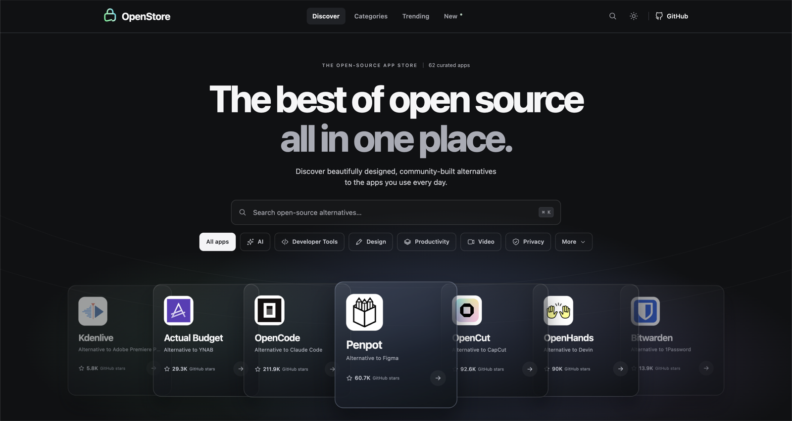

# OpenStore

OpenStore is a curated directory for discovering well-made open-source alternatives to proprietary software.



It combines editorial app discovery with practical details for each project: what it replaces, supported platforms, GitHub stars, license, official links, screenshots, and related projects.

## Highlights

- Browse 62 curated projects across AI, developer tools, design, video, productivity, privacy, finance, fitness, and utilities.
- Search by app name, category, description, or the proprietary tool a project can replace.
- Filter by category, platform, GitHub stars, trending status, and self-hosting support.
- Review project detail pages with official assets, repository metadata, license details, platform support, and alternatives.
- Keep local bookmarks and share URLs that preserve search and filter state.
- Use a responsive interface built for desktop and mobile browsing.

## Run locally

OpenStore requires a current Node.js LTS release.

```sh
npm install
npm run dev
```

Open [http://localhost:3000](http://localhost:3000).

| Command | Purpose |
| --- | --- |
| `npm run dev` | Start the local development server. |
| `npm test` | Validate catalog data, metadata, assets, and filtering behavior. |
| `npm run build` | Create and validate the production build. |
| `npm start` | Serve a completed production build. |
| `npm run build:legacy` | Build the previous static distribution. |

## Project structure

```text
app/                  Next.js application shell and document metadata
public/legacy/        Client-side catalog renderer used by the interface
catalog.js            Core curated projects
open-catalog.js       Open-prefixed projects
trending-catalog.js   Projects observed in weekly GitHub trending data
assets/               Repository snapshots, official icons, and asset sources
research/             Catalog audit and research notes
tests/                Catalog integrity tests
```

## Catalog data

OpenStore stores repository metadata, trending observations, verified review snapshots, and icon provenance in the repository so the directory can browse quickly without calling third-party APIs at runtime.

- GitHub metadata: [`assets/github-snapshot.json`](assets/github-snapshot.json)
- Trending observations: [`assets/trending-snapshot.json`](assets/trending-snapshot.json)
- Official icon provenance: [`assets/official-icons.json`](assets/official-icons.json)
- Image and screenshot sources: [`assets/asset-sources.json`](assets/asset-sources.json)
- Editorial and research audit: [`research/catalog-audit.md`](research/catalog-audit.md)

Star counts and trending positions are point-in-time snapshots. Alternatives describe overlapping use cases, not guaranteed feature parity.

## Contributing

Issues and pull requests are welcome. When adding or updating a project, keep the catalog useful and verifiable:

1. Use the project’s official repository and website.
2. Add a concise use case, proprietary alternatives, supported platforms, and an honest consideration.
3. Use the official project icon and record its source plus checksum in the asset manifests.
4. Update the matching file in `public/legacy/` when changing a catalog file.
5. Run `npm test` and `npm run build` before opening a pull request.

The data refresh script, `python3 scripts/research.py --refresh-metadata --refresh-trending`, updates repository metadata, official assets, and observed weekly trending data. Customer-review evidence is intentionally rechecked manually.

## License

OpenStore’s source code is available under the [MIT License](LICENSE). App names, trademarks, icons, screenshots, and other third-party project material remain subject to their respective owners’ terms.
